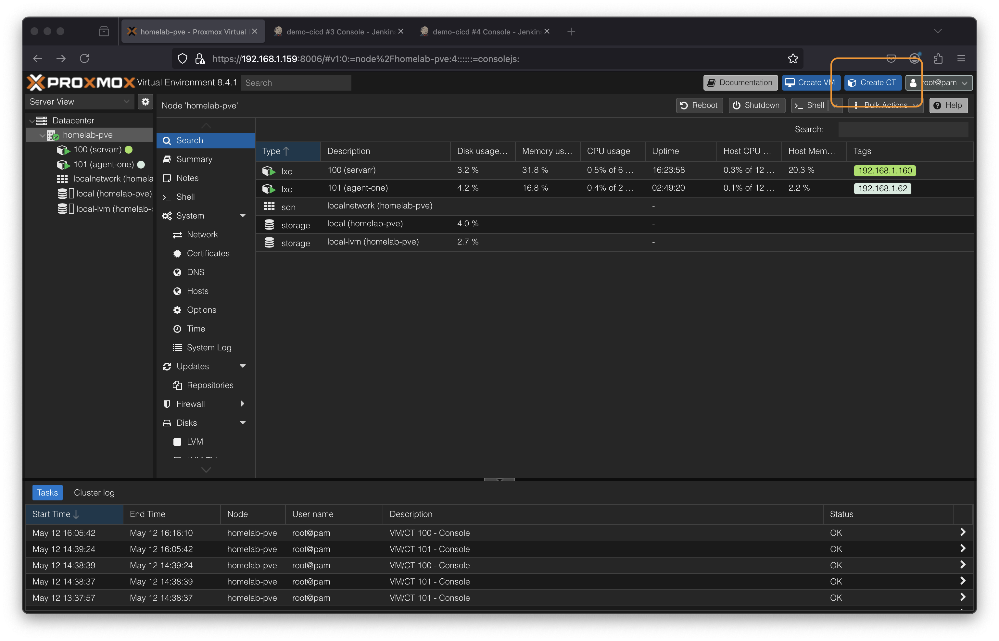
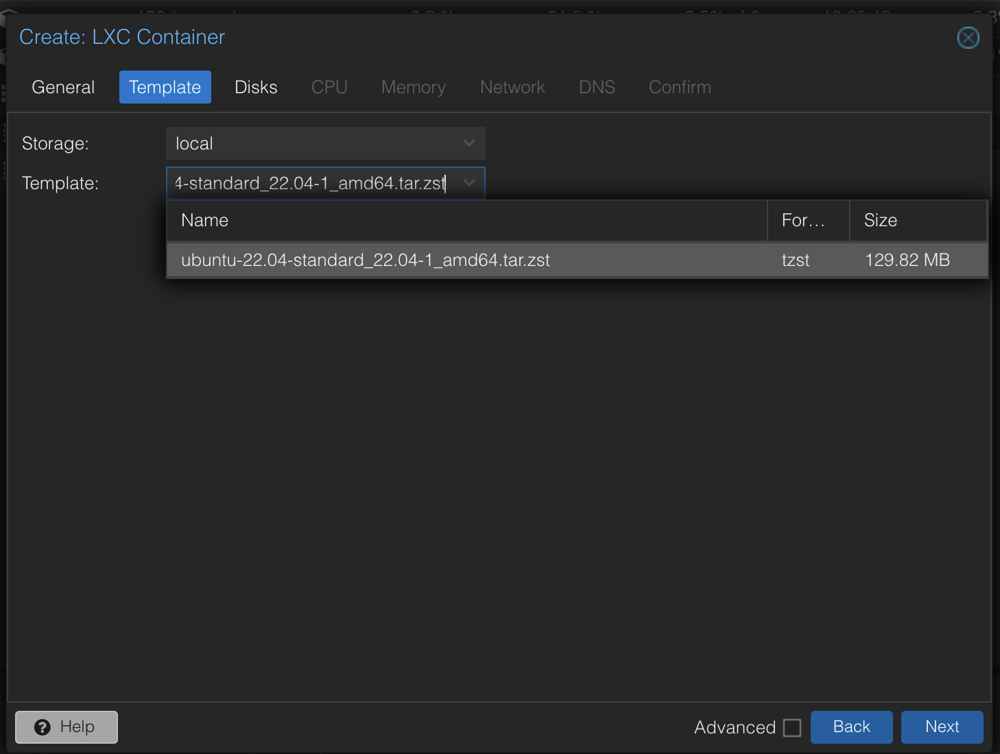
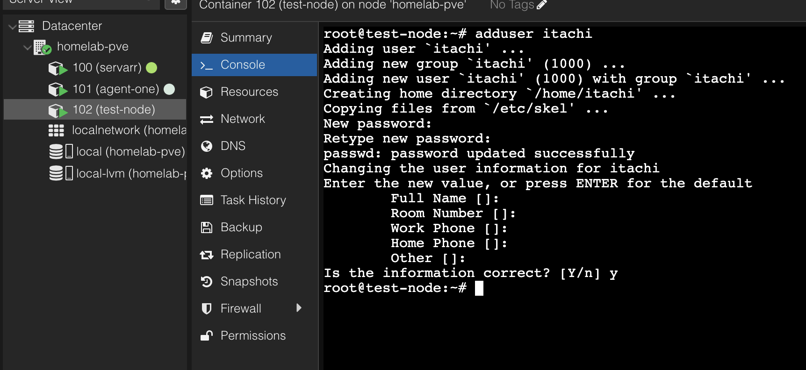

###




## add hostname of your choice

## add pass word and click next


## choose template



## Select disk size


## Select no of cores


## Select 'Ram'/ memory size


## choose ipv4 (your network CIDR range)

## IP of your rauter


## DNS leave as it is

## check and confirm details. Click finish


## IT should say 'Test Ok'


## start your node


1. Default username is always 'root' and use password which you created during the initial stage of creating the node

## if everything goes well you should see you node like this


# Always create a user (there should be no access to the node directly)

## we have created a user name itachi

````bash
adduser itachi



```bash
adduser itachi sudo
# Add user (itachi here.) to sudo group

````

## ssh into your from your personal pc

```bash
ssh your-node-name@your-ip-addr


```
