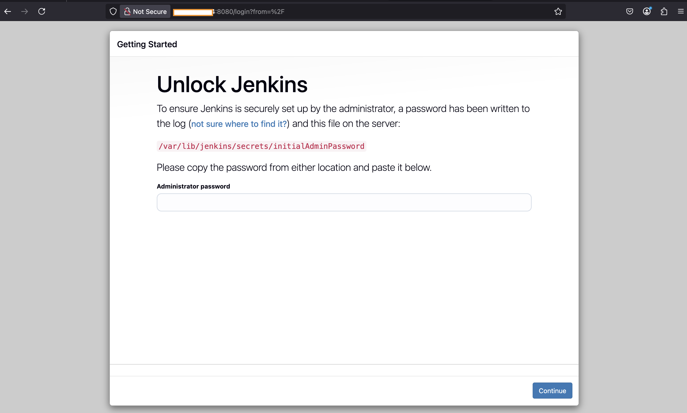
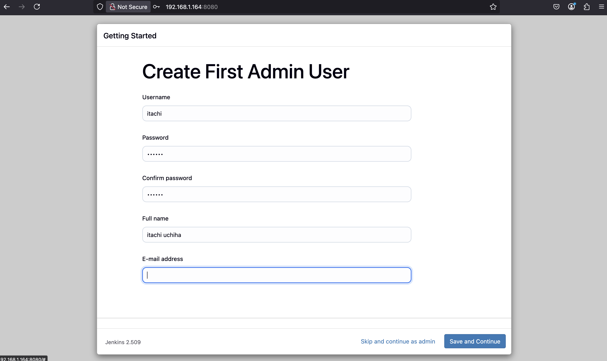
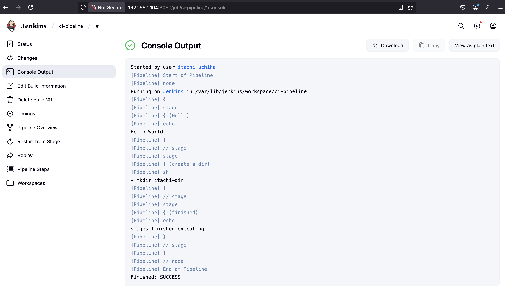
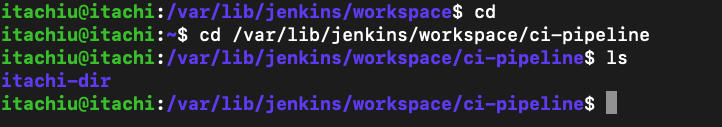
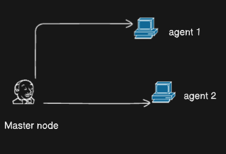
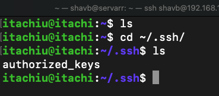
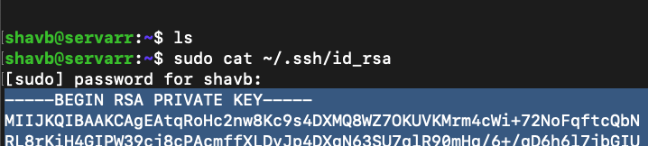
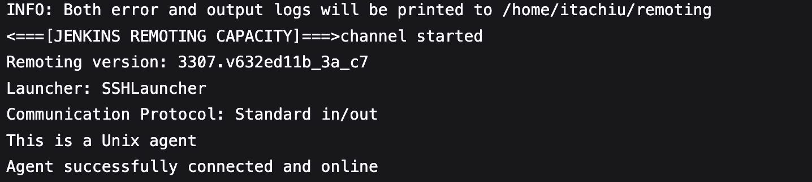
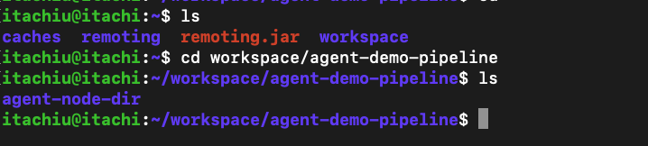

# setup jenkins in your master node

### setup jenkins

- Prerequisites for jenkins
  Java

  ```bash
  sudo apt install openjdk-17-jre
  ```

  #### check java isInstalled

  ```bash
    java -version
  ```

### Install Jenkins CI

#### get the keys

```bash
curl -fsSL https://pkg.jenkins.io/debian/jenkins.io-2023.key | sudo tee \
/usr/share/keyrings/jenkins-keyring.asc > /dev/null
echo deb [signed-by=/usr/share/keyrings/jenkins-keyring.asc] \
https://pkg.jenkins.io/debian binary/ | sudo tee \
/etc/apt/sources.list.d/jenkins.list > /dev/null
```

#### install jenkins

```bash
sudo apt-get update
sudo apt-get upgrade -y
sudo apt-get install jenkins
```

#### verify jenkins service status

```bash
sudo systemctl status jenkins
```

#### if not started/running

```bash
sudo systemctl enable jenkins
sudo systemctl start jenkins
```

# from you personal pc got the any browser

#### What is my node IP?

```bash
sudo ip addr show
```

#### or

```bash
sudo ip a
```

```bash
http://your-node-ip:8080
```

#### it should look like this



#### get your initial admin password and paste it

```bash
cat /var/lib/jenkins/secrets/initialAdminPassword
```

#### click next with default settings

#### fill your data. Click next



#### Go with default jenkins URL and click finish

# Creating basic jenkins pipeline

1. Click 'New Item'
2. Enter your pipeline eg: (ci-pipeline) and choose pipeline. Click Ok.
3. Go to definition and create your own 'Pipeline script'

```bash
  pipeline {
    agent any

    stages {
        stage('Hello') {
            steps {
                echo 'Hello World'
            }
        }
        stage('create a dir') {
            steps {
                sh 'mkdir itachi-dir'
            }
        }
        stage('finished') {
            steps {
                echo 'stages finished executing'
            }
        }
    }
}
```

#### click save and Click Build now from left navbar

#### go to Console Output

#### You should see something like this.



#### Lets check the dir which we created

```bash
cd /var/lib/jenkins/workspace/ci-pipeline
ls
```

#### You should see the dir which we created using pipeline script.



# Creating agents

#### Above where we created pipeline using grovy scripting we used agent as any

#### We don't want that. So we will create our own agent (creating another in proxmox server)

#### Follow steps from crreating-nodes

Now we have created our agent. Now we will connet our master with slave/agents



#### creating ssh keys to access the slave node

#### here I have used "jenkins-agent" you can name it anything you like

#### -m PEM

```bash
 -m
```

stands for "format of the key"

```bash
 PEM
```

tells ssh-keygen to generate a private key in 'PRIVACY ENHANCED MAIL' format. (base64-encoded)

#### keys will be generate in ~/.ssh/

1. id_rsa (private key)
2. id_rsa.pub (public key)

```bash
  ssh-keygen -t rsa -b 4096 -m PEM -C "jenkins-agent"
```

#### Copy the SSH public key to remote machine which is our agent which we created

#### treating the newly created node/agent as master which I have named named as 'servarr'

```bash
  ssh-copy-id itachiu@you-ip
```

#### public is copy to rour itachiu machine



#### let's head back to our jenkins and setup the credentials and create nodes

Settings -> credentials -> (global) -> + Add Credentials

kind -> SSH Username with private key
id -> itachi-main-key (give name of your choice)

#### Username is important

(name of your agent/node name created in PROMOX)
username -> itachiu

#### Get the private key from your master node



#### Paste the key here

private key -> enter directly

### Creating out agent

manage jenkins -> nodes -> + New Node

1. name of your agent (itachi-agent)
2. Permanent Agent -> create
3. Remote root directory -> /home/name-of-your-node eg: /home/itachiu
4. labels: (V.V.V IMP) eg: itachi-agent-node
5. Usage: Keep it default
6. Launch method

   - Launch via SSH
   - HOST: ip address of your agent from PROXMOX
   - Credentials: name of the credentials we just created (itachi-main-key)
   - Host Key Verification Strategy: Non Verifying:Verification Strategy
   - remaining as default and click save

7. Check logs and your agent should be connected.
   

#### Let's use this newly created agent

#### create a pipeline

#### Head back yo our 'ci-pipeline' and configure it

#### Go to pipeline script and Add.

```bash
pipeline {
    agent {
        label 'itachi-agent-node'
    }

    stages {
        stage('Hello') {
            steps {
                echo 'Hello World from agent node 1'
            }
        }
        stage('Make a directory in agent node') {
            steps {
                sh 'mkdir agent-node-dir'
            }
        }
        stage('finished exec') {
            steps {
                echo 'Task finished'
            }
        }

    }
}
```

#### click apply and save

#### Click on build now

#### if everything is okay! as per the Pipeline script it should have created a dir in agent node


